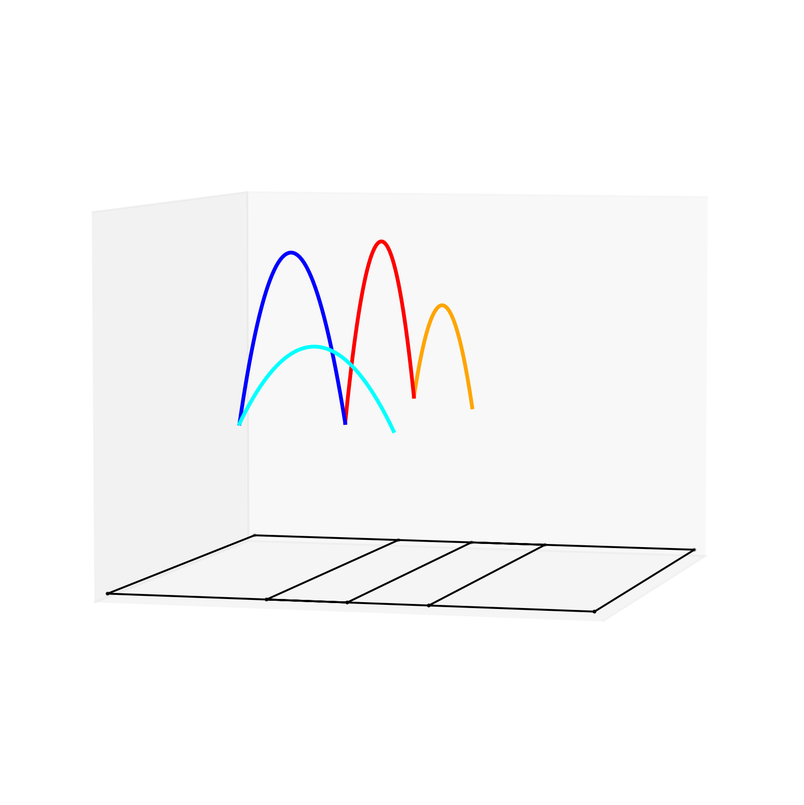
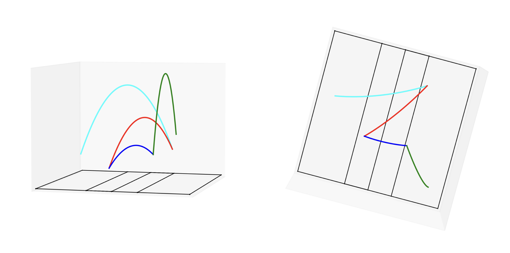
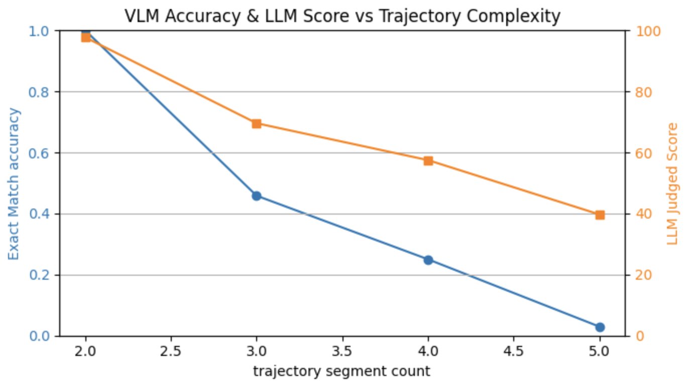
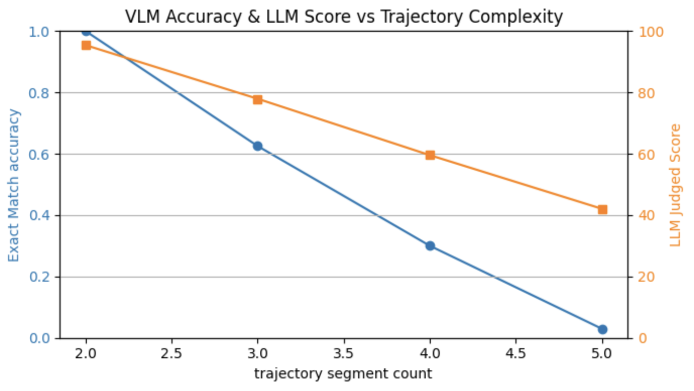
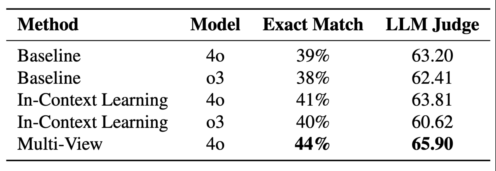

# 🧠 Puzzle Lab: 3D Trajectory Reasoning Benchmark

A benchmark for evaluating Vision-Language Models (VLMs) on spatial-temporal reasoning through 3D ball trajectory ordering tasks.

## 🎯 Overview

This benchmark tests the visual reasoning capabilities of modern VLMs by challenging them to determine the temporal order of colored trajectory segments in 3D space. Each input consists of a 3D image showing a ball's segmented trajectory, where each segment is colored differently. The goal is to reconstruct the correct sequence of motion based on visual cues such as motion continuity, segment connections, and implicit directional cues.

>Example: Give a 3D ball trajecories image
>
>The correct answer is:  `[['orange', 'green', 'red', 'blue', 'cyan'], ['cyan', 'blue', 'red', 'green', 'orange']]`

This task simulates real-world spatial-temporal reasoning that requires understanding of:
- Multi-segment trajectory interpretation
- Motion continuity and physics
- 3D spatial relationships
- Temporal sequence inference

## 📁 Dataset

The dataset contains **100 trajectory images** with varying complexity:

- **Trajectory segments**: 2-5 colored segments per image
- **Colors available**: red, blue, green, orange, cyan
- **Multiple valid answers**: Some trajectories can be interpreted in both directions
- **Multi-view support**: Each trajectory includes a second camera angle for spatial understanding

**Dataset distribution by complexity:**
- 2 segments: 22 images (22%)
- 3 segments: 24 images (24%) 
- 4 segments: 20 images (20%)
- 5 segments: 34 images (34%)

## 🎯 Evaluation Goals

We aim to test whether modern VLMs can:
- ✅ Interpret multi-segment ball trajectories in 3D space
- ✅ Infer correct movement order based on spatial and visual continuity
- ✅ Generalize across different viewing angles and complexity levels
- ✅ Maintain performance as trajectory complexity increases

## 📐 Evaluation Metrics

**1. Exact Match**: Binary accuracy where predictions must exactly match one of the possible ground truth sequences (order-sensitive)

**2. LLM Judge (GPT-4)**: External evaluation on a 1-100 scale based on prediction plausibility and reasoning logic

## 🔬 Experiments

We conducted three main experimental settings:

### 1. **Baseline**
Single-view prediction based only on the visual input

### 2. **In-Context Learning (ICL)** 
A solved example is provided to guide reasoning before the target image

### 3. **Multi-View Setting**
The same trajectory shown from multiple camera angles to improve spatial understanding

## 🧠 Models Evaluated

- **GPT-4o**: OpenAI's vision-language model
- **O3**: Advanced reasoning model

## 📊 Results

| Baseline | MultiView |
|----------|---------------------|
|| |

### Ablation Study

## 📈 Key Findings

1. **Perfect Performance on Simple Cases**: Both models achieve 100% accuracy on 2-segment trajectories

2. **Significant Complexity Degradation**: Performance drops dramatically as segment count increases
   - 3 segments: ~40% accuracy
   - 4 segments: ~25-30% accuracy  
   - 5 segments: <3% accuracy

3. **Model Parity**: GPT-4o and O3 show remarkably similar performance across all settings

4. **Limited ICL Benefits**: In-context learning provides only modest improvements (1-2% gain)

5. This experiment shows that using a multi-view approach can further improve the VLM performance in trajectory reasoning.

---

*This benchmark provides a standardized evaluation framework for advancing VLM spatial reasoning capabilities in 3D trajectory understanding.*